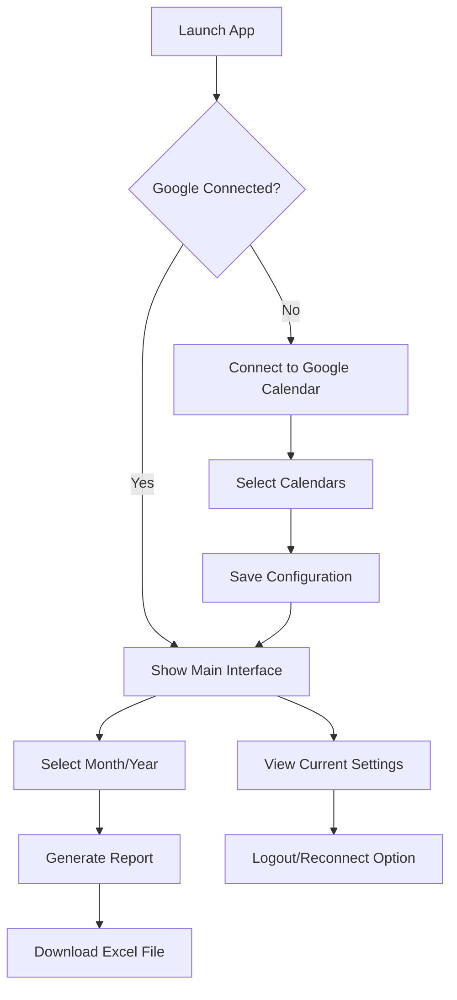
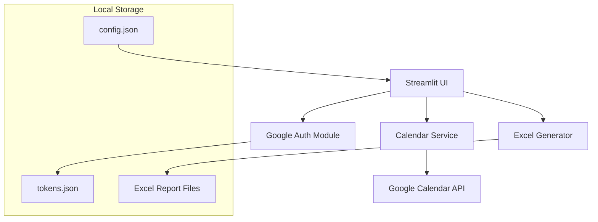
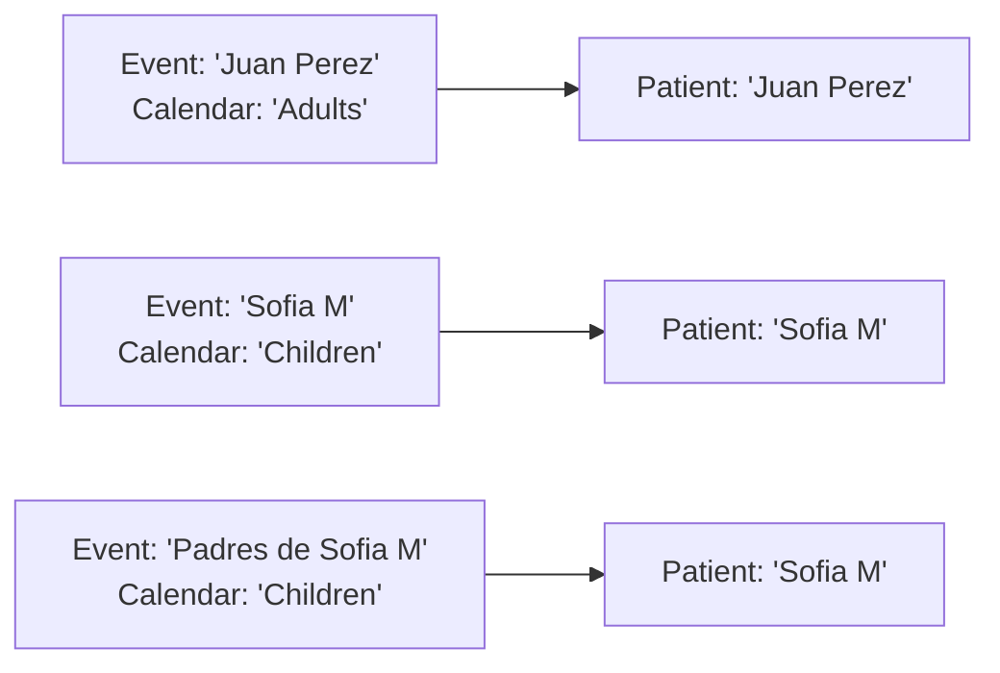

# Shape Document: GCal Extractor

## Problem Statement

A psychology professional needs a faster way to analyze consultation frequency per patient from her Google Calendar events. Currently, she maintains accurate consultation records in Google Calendar but lacks an efficient way to generate reports showing consultation totals and details by patient.

## Appetite

**1 week ViebCoding** - This is a focused, single-purpose application with clear boundaries and well-defined requirements.

## Solution Overview

A Streamlit-based Python application that connects to Google Calendar, processes consultation events, and generates Excel reports with patient consultation summaries and details.

### User Flow



### Technical Architecture



## Key Features

### 1. Google Calendar Integration
- **OAuth 2.0 Authentication**: Secure connection to personal Google account
- **Token Management**: Automatic token refresh, persistent storage
- **Multi-Calendar Support**: Select and process multiple calendars simultaneously

### 2. Calendar Selection & Configuration
- **One-time Setup**: Select relevant calendars during initial configuration
- **Persistent Settings**: Save calendar selection in local config file
- **Calendar Identification**: Display selected calendars in UI (read-only)
- **Reconfiguration**: Logout/login to change calendar selection

### 3. Patient Data Processing
- **Event Title as Patient Name**: All calendar events represent patient consultations
- **Parent Session Handling**: Events starting with "Padres de [Patient Name]" are treated consultations of the same [Patient Name] for totals, but must be shown as separate patients in the "detalle" sheet.
- **Name Matching**: Capitalize and remove trailing/leading spaces from all names before matching. No fuzzy matching.

### 4. Report Generation
- **Month/Year Selection**: Simple date picker for reporting period
- **Dual Sheet Excel Output**:
  - **Sheet 1 "totales"**: Calendar, patient name and total consultation count
  - **Sheet 2 "detalle"**: Patient columns with consultation dates listed below organized by calendar.
- **Date Formatting**: All dates in dd/mm/yyyy format

## Data Flow

### Input Processing


### Output Structure
**Sheet 1 - totales:**
| calendario | nombre | total |
|--------|--------|-------|
| adultos | Juan Perez (Adults) | 4 |
| ninos | Sofia M (Children) | 3 |

**Sheet 2 - detalle:**
| Juan Perez | Padres de Sofia M | Sofia M |
|-|-|-|
| adultos  <td colspan="2" align="center"> ninos </td>
| 03/01/2024 | 05/01/2024 | 12/01/2024 |
| 10/01/2024 |  | 24/01/2024 |
| 17/01/2024 |  |  |
| 24/01/2024 |  |  |

## Technical Specifications

### File Structure
```
├── streamlit_app.py          # Main UI application
├── google_auth.py            # OAuth handling
├── calendar_service.py       # Google Calendar API integration
├── excel_generator.py        # Report generation
├── requirements.txt          # Dependencies
├── config.json              # Calendar selection (generated)
├── tokens.json              # OAuth tokens (generated)
└── reports/                 # Generated Excel files
```

### Dependencies
- `streamlit` - Web UI framework
- `google-auth-oauthlib` - Google OAuth
- `google-api-python-client` - Google Calendar API
- `pandas` - Data processing
- `openpyxl` - Excel file generation

### Configuration Files

**config.json format:**
```json
{
  "selected_calendars": [
    {"id": "primary", "name": "Principal"},
    {"id": "calendar_id_2", "name": "Niños"}
  ]
}
```

## User Interface Requirements

### Authentication State
- **Not Connected**: Large "Connect to Google Calendar" button
- **Connected**: Show connection status and selected calendars

### Main Interface
- **Calendar Display**: Read-only list of selected calendars
- **Month/Year Picker**: Dropdown selectors for reporting period
- **Generate Button**: Process and create report
- **Download Button**: Downloads the generated Excel file.
- **Settings Section**: Logout/reconnect option

### Error Handling
- **Network Issues**: "Connection failed. Please try again later."
- **API Rate Limits**: "Service temporarily unavailable. Please try again in a few minutes."
- **Invalid Date Range**: "Please select a valid month and year."
- **No Events Found**: "No consultations found for the selected period."

## Wireframes

```
[ Google Calendar Status: Connected ✓ ]
[ Selected Calendars: Adultos, Niños    ]

┌─────────────────────────────┐
│ Generate Consultation Report│
├─────────────────────────────┤
│ Month: [January ▼]          │
│ Year:  [2024 ▼]            │
│                             │
│ [Generate Report]           │
│                             │
│ Status: Ready               │
│ [Download Excel File]       │
└─────────────────────────────┘

[ Settings: Logout & Reconnect ]
```

## Risks and Mitigations

### Technical Risks
1. **Google API Rate Limits**: 
   - *Risk*: Hitting daily/per-minute quotas
   - *Mitigation*: Clear error messaging

2. **Token Expiration**: 
   - *Risk*: Tokens becoming invalid between sessions
   - *Mitigation*: Automatic refresh mechanism with fallback to re-authentication

3. **Large Calendar Data**: 
   - *Risk*: Performance issues with calendars containing many events
   - *Mitigation*: Efficient date filtering, progress indicators

### User Experience Risks
1. **Complex Initial Setup**: 
   - *Risk*: User confusion during calendar selection
   - *Mitigation*: Clear instructions, intuitive calendar display

2. **File Management**: 
   - *Risk*: User losing generated reports
   - *Mitigation*: Consistent naming convention, clear download location

## Success Metrics

1. **Functional**: Successfully generates accurate Excel reports from Google Calendar data
2. **Usability**: User can complete full workflow (connect → configure → generate → download) in under 3 minutes
3. **Reliability**: Handles authentication refresh and basic error scenarios gracefully
4. **Accuracy**: Report data matches actual calendar events with 100% precision

## Out of Scope

- Multi-user support or user management
- Advanced reporting features (charts, statistics, date filtering beyond month)
- Integration with practice management systems
- Mobile app version
- Real-time sync or scheduling features
- Data backup or cloud storage of reports
- Email delivery of reports
- Custom report templates or formatting options

---

**Circuit Breaker**: If Google Calendar API integration proves more complex than anticipated, stop development.